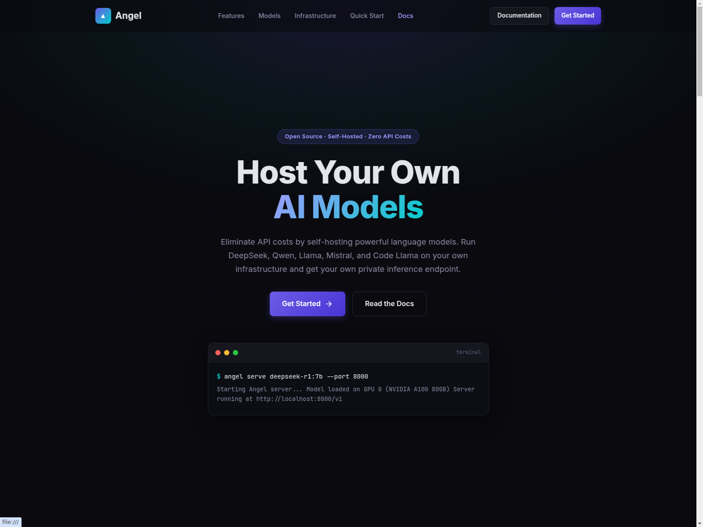
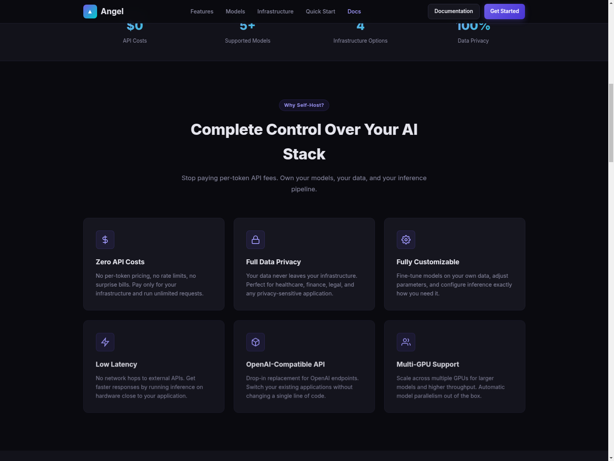
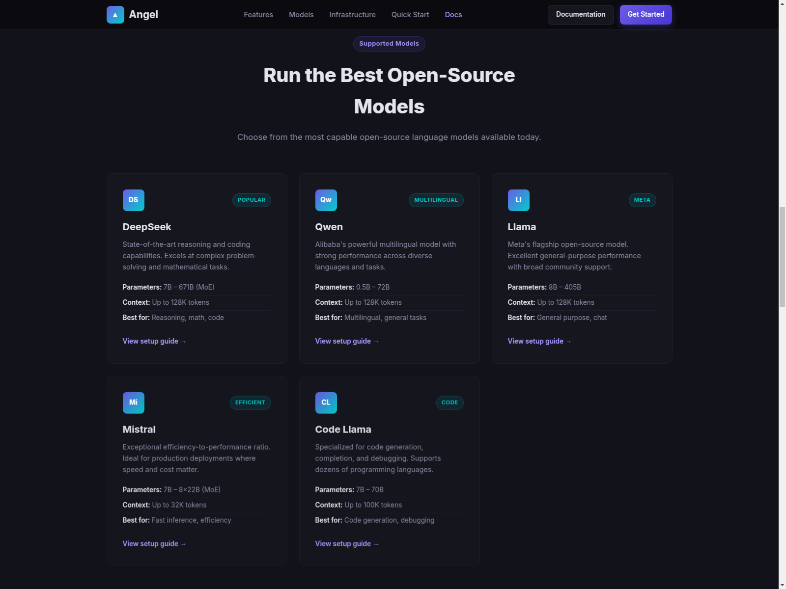
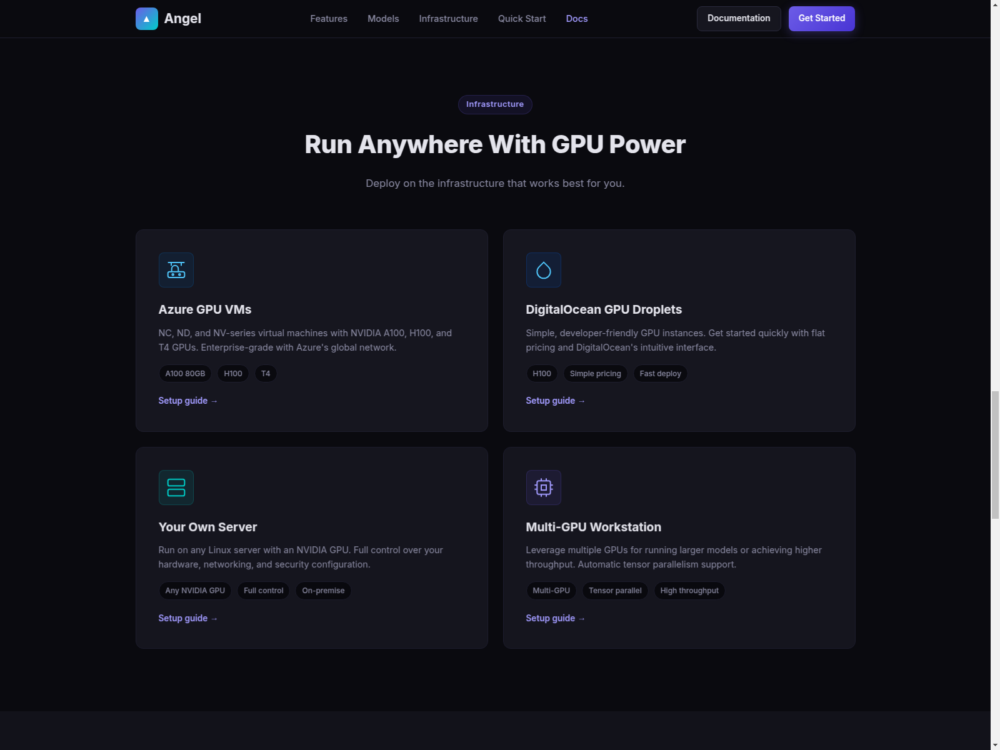
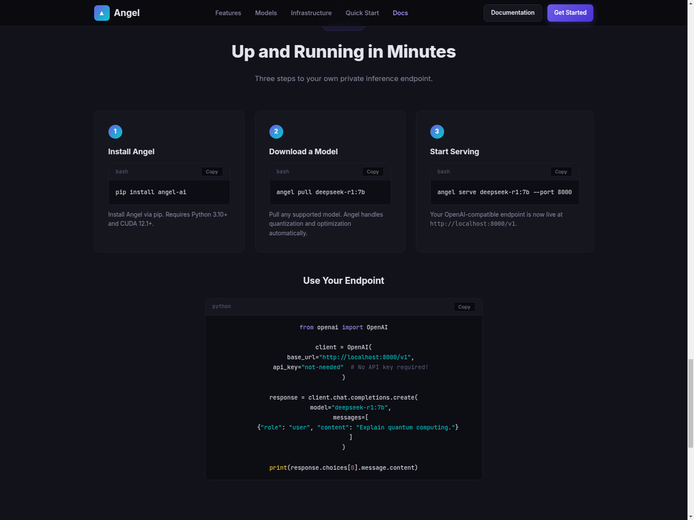
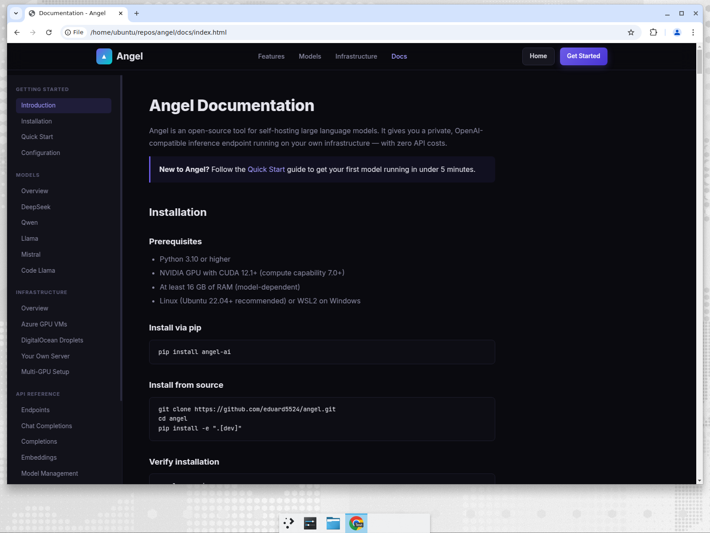

<h1 align="center">Angel - Self-Host Your Own AI Models</h1>

<div align="center">Eliminate API costs by self-hosting powerful language models on your own infrastructure</div>

<h3 align="center">
  <a href="https://github.com/eduard5524/angel">View Source</a> |
  <a href="docs/index.html">Documentation</a>
</h3>

## Overview

Angel is an open-source tool for self-hosting large language models. It gives you a private, OpenAI-compatible inference endpoint running on your own infrastructure — with zero API costs. Run DeepSeek, Qwen, Llama, Mistral, and Code Llama with a simple CLI.



## Features

- **Zero API Costs** — No per-token pricing, no rate limits, no surprise bills
- **Full Data Privacy** — Your data never leaves your infrastructure
- **Fully Customizable** — Fine-tune models on your own data and adjust parameters
- **Low Latency** — No network hops to external APIs
- **OpenAI-Compatible API** — Drop-in replacement for OpenAI endpoints
- **Multi-GPU Support** — Scale across multiple GPUs with automatic model parallelism



## Supported Models

| Model | Parameters | Context | Best For |
|-------|-----------|---------|----------|
| **DeepSeek** | 7B – 671B (MoE) | Up to 128K tokens | Reasoning, math, code |
| **Qwen** | 0.5B – 72B | Up to 128K tokens | Multilingual, general tasks |
| **Llama** | 8B – 405B | Up to 128K tokens | General purpose, chat |
| **Mistral** | 7B – 8x22B (MoE) | Up to 32K tokens | Fast inference, efficiency |
| **Code Llama** | 7B – 70B | Up to 100K tokens | Code generation, debugging |



## Infrastructure Options

Angel runs anywhere you have GPU power:

- **Azure GPU VMs** — NC, ND, and NV-series with NVIDIA A100, H100, and T4 GPUs
- **DigitalOcean GPU Droplets** — Simple, developer-friendly GPU instances
- **Your Own Server** — Any Linux server with an NVIDIA GPU
- **Multi-GPU Workstation** — Leverage multiple GPUs for larger models



## Quick Start

### Prerequisites

- Python 3.10 or higher
- NVIDIA GPU with CUDA 12.1+ (compute capability 7.0+)
- At least 16 GB of RAM (model-dependent)
- Linux (Ubuntu 22.04+ recommended) or WSL2 on Windows

### 1. Install Angel

```bash
pip install angel-ai
```

### 2. Download a Model

```bash
angel pull deepseek-r1:7b
```

### 3. Start Serving

```bash
angel serve deepseek-r1:7b --port 8000
```

Your OpenAI-compatible endpoint is now live at `http://localhost:8000/v1`.



### Use Your Endpoint

```python
from openai import OpenAI

client = OpenAI(
    base_url="http://localhost:8000/v1",
    api_key="not-needed"  # No API key required!
)

response = client.chat.completions.create(
    model="deepseek-r1:7b",
    messages=[
        {"role": "user", "content": "Explain quantum computing."}
    ]
)

print(response.choices[0].message.content)
```

## Documentation

Full documentation is available in the [docs](docs/index.html) directory, covering installation, model configuration, API reference, and infrastructure setup guides.



## License

[MIT](https://opensource.org/licenses/MIT)
